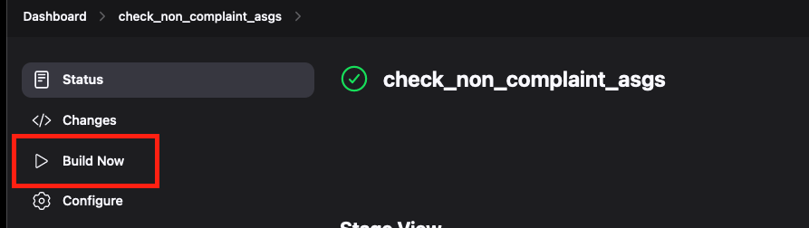

# Automation-demo

<h3> Introduction:</h3>

This project demonstrates how we can setup a basic automation using Jenkins, Terraform, python and shell on the AWS Cloud.

**Jenkins**: Jenkins is an open source automation server. It helps automate the parts of software development related to building, testing, and deploying, facilitating continuous integration, and continuous delivery.

**Terraform**: Terraform is an open-source infrastructure as code software tool created by HashiCorp. It enables users to define and provision data center infrastructure using a declarative configuration language known as HashiCorp Configuration Language (HCL).

### File Structure:

**Diagrams:** This directory contains the architecture diagrams for the project.
- aws_arch.jpg: This diagram shows the architecture of the cloud infrastructure that is deployed using terraform.

**Images:** This directory contains the images that are used in the README.md file.

**Jenkinsfiles:** This directory contains all the Jenkinsfiles that are used for our automation.
- **cloud_demo_deployment**: This Jenkinsfile is used to deploy the cloud infrastructure(infrastructure mentioned in the diagrams->aws_arch.jpg) using terraform.
- **cloud_demo_deployment_destroy**: This Jenkinsfile is used to destroy the cloud infrastructure(infrastructure mentioned in the diagrams->aws_arch.jpg) using terraform.
- **create_patch_policy**: This Jenkinsfile is used to create a patch policy for that ensures that the EC2 instances are updated with the latest patches every week at a set maintenance window.
- **delete_patch_policy**: This Jenkinsfile is used to delete the patch policy that was created using the create_patch_policy Jenkinsfile.
- **deploy_s3_bucket**: This Jenkinsfile is used to deploy an S3 bucket that is required for storing the terraform state files using python3 and also sets up the SNS notifier.
- **non_complaint_asg**: This Jenkinsfile is used to check for non-compliant ASG instances and alert the user that the instances are non-compliant and also trigger a deployment job that will make update the instances to be compliant.
- **set_old_ami_for_deployment**: This Jenkinsfile is used to set the old AMI for the ASG to test whether the non_complaint_asg jenkins job can detect it and update the ASG's.

**Python:** This directory contains the python scripts that are used for checking non complaint asg's and some scripts for deploying some AWS resources.
- **ASG_Complaince/check_asg.py:** This python script is used to check for non-compliant ASG instances and alert the user that the instances are non-compliant.
- **JenkinsAPI/jenkins_api.py:** This python script is used to interact with the Jenkins API to trigger the Jenkins jobs.
- **Logger/logger.py:** This python script is used to create a custom logger that will log the messages to the console.
- **S3_Bucket_Deployer/deploy_s3_bucket.py:** This python script is used to deploy an S3 bucket that is required for storing the terraform state files using python3.
- **SNS_Setup/sns_notifier.py:** This python script is used to setup the SNS notifier that will email the user when the ASG instances are non-compliant.
- 
**Shell:** This directory contains the shell scripts that are used for the setting up and destroying the infrastructure for Patching EC2 instances.
- **PatchManager/patch_policy.sh:** This shell script is used to create a patch policy for that ensures that the EC2 instances are updated with the latest patches every week at a set maintenance window.
- **PatchManager/remove-all-patch-baseline.sh:** This shell script is used to delete all the custom patch baselines created.
- **PatchManager/remove-all-mw.sh:** This shell script is used to delete all the maintenance windows created.
- **PatchManager/remove-patch-group.sh:** This shell script is used to delete the patch group created.

**Terraform:** This directory contains the terraform scripts that can used to create the AWS infrastructure.
- **shell_scripts:** This directory contains the shell script that creates a sample web app on EC2.
- **alb.tf:** This terraform code is used to create an Application Load Balancer, target groups and Load balancer Listeners.
- **asg.tf:** This terraform code is used to create an Auto Scaling Group, Launch Configuration and Autoscaling Policies.
- **backend.tf:** This terraform code is used to configure the backend for the terraform state files.
- **data.tf:** This terraform code is used to get the account_id for the aws account the resource is being deployed to.
- **outputs.tf:** This terraform code is used to output the DNS name of the Application Load Balancer.
- **provider.tf:** This terraform code is used to configure the provider for the terraform code.
- **sg.tf:** This terraform code is used to create the security groups for the infrastructure being created.
- **variables.tf:** This terraform code is used to define the variables that are used in the terraform code.
- **vpc.tf:** This terraform code is used to create the VPC, Subnets, Route Tables, Nat Gateway and Internet Gateway.


AWS Architecture Diagram:


<h4> Order to run the Jenkinsfiles:</h4>

1) deploy_s3_buckets
2) cloud_demo_deployment
3) non_complaint_asg
4) set_old_ami_for_deployment
5) non_complaint_asg
6) cloud_demo_deployment_destroy
7) create_patch_policy
8) delete_patch_policy


<h3>Prerequisites:</h3>

1) <b>AWS Cli:</b> <br>
    ```
    https://docs.aws.amazon.com/cli/latest/userguide/getting-started-install.html
    ```
    
2) <b>Python3:</b> <br>
    ```angular2html
    https://www.python.org/downloads/
    ```
3) <b>Jenkins:</b> <br>
   ```angular2html
    https://www.jenkins.io/doc/book/installing/
   ```
4) <b>Terraform:</b> <br>
   ```angular2html
    https://developer.hashicorp.com/terraform/install?product_intent=terraform
   ```

<h3>Setting up the tools:</h3>

<h4>Setting up AWS Cli:</h4>

1) Open your AWS management console on your browser and open up the IAM service.
2) Create a new user using the user section on page. <br>
   
3) Click on create user option and in the creation screen give a friendly name to this user.
4) Next click on <b>Attach policies directly</b> option and attach the <b>PowerUserAccess</b> policy to the user. <br>
   <b>Note: Attaching poweruserplus access is not the best practise always ensure every service gets only the correct amount 
         permissions. (only use poweruserplus for the demo).</b><br>
    
5) After attaching the policy go ahead and create the user.
6) Now click on the newly created user and navigate to the security credentials option and scroll down to find the <b>
   Create Access Key</b> button. <br>
7) Chose the <b>Command Line Interface</b> and tick the confirmation statement below and click on the next button.
    
8) Click on the download CSV to get the <b>Access Key</b> and <b>Secret Key</b> which we will use for later.
    
9) Run the following command to check aws cli is installed.
   ```
   aws --version
   ```
10) Run the below command to add your credentials to interact with AWS.
    ```
    aws configure
    ```
11) Enter the Access Key and Secret from the csv file downloaded from the console and use us-east-1 as the default region. <br>
    
12) Run the below query to test if the aws credentials are configured correctly.

    ```
    aws s3 ls --region us-east-1
    ```
    The command should either return nothing or some buckets if you have any, if you receive an error that indicates that
    the credentials are not configured correctly.

<h3>Setting up Python3:</h3>

<h4>Mac Setup</h4>

```
brew install python3
```
Note: Already installed on the system in case it is not please use the below command.<br>


<h4>Linux Setup</h4>

```
sudo apt install python3
```
Note: Already installed on the system in case it is not please use the below command.<br>


<h3>Setting up the python environment for local testing</h3>

Please follow the below steps to setup a virtualenv for the environment:
```
cd /path-to-dir/automation-demo/python
python3 -m venv .venv
source .venv/bin/activate
pip3 install -r requirements.txt
python3 python_file_to_execute.py
```


<h3>Setting  up Terraform</h3>

Setting up terraform on Mac:
```angular2html
brew install terraform
terraform --version
```
Setting up terraform on Linux:
```
#Install Dependencies

sudo apt-get update && sudo apt-get install -y gnupg software-properties-common

# Install the GPG key

wget -O- https://apt.releases.hashicorp.com/gpg | \
gpg --dearmor | \
sudo tee /usr/share/keyrings/hashicorp-archive-keyring.gpg > /dev/null

#Verify the key's GPG key

gpg --no-default-keyring \
--keyring /usr/share/keyrings/hashicorp-archive-keyring.gpg \
--fingerprint

#Add the official HashiCorp repository to your system

echo "deb [signed-by=/usr/share/keyrings/hashicorp-archive-keyring.gpg] \
https://apt.releases.hashicorp.com $(lsb_release -cs) main" | \
sudo tee /etc/apt/sources.list.d/hashicorp.list

#Download the package information from Hashicorp

sudo apt update

# Install Terraform

sudo apt-get install terraform
```

<h3>Setting up Jenkins</h3>

<h4>Setting up Jenkins on Mac:</h4>

```
brew install jenkins
brew services start jenkins
```

<h4>Setting up Jenkins on Linux:</h4>

```
#Install Jenkins
wget -q -O - https://pkg.jenkins.io/debian/jenkins.io.key | sudo apt-key add -
sudo sh -c 'echo deb http://pkg.jenkins.io/debian-stable binary/ > \
/etc/apt/sources.list.d/jenkins.list'
sudo apt-get update
sudo apt-get install jenkins
sudo systemctl start jenkins
sudo systemctl status jenkins
```
Follow the setup instructions on the browser to complete the setup.

<h3>Setting up the Jenkins Credentials</h3>

<h4>Setting up Github ssh login:</h4>

1) Create a ssh key using the below command
    
    ```
    ssh-keygen -t rsa -b 4096 -C "your_email"
    ```
2) Copy the public key using the below command: 
    
    ```
   cat ~/.ssh/id_rsa.pub
    ```
3) Go to the Github settings and click on the SSH and GPG keys option and click on the new SSH key option. <br>
4) Paste the copied key in the key section and give a title to the key and click on the add SSH key button. <br>
5) Now go to the Jenkins dashboard and click on the Manage Jenkins button. <br>
    
6) Click on the Manage Credentials option and click on the global credentials domain. <br>
    
    
7) Click on the Add Credentials option and select the SSH Username with private key option. <br>
    
8) Enter the username as <b>GITHUB_ACCESS_KEY</b> and select the private key as the key option and paste the private key in the key section. <br>
    
9) Click on the OK button to save the credentials. <br>

<h4>Setting up Jenkins Credentials</h4> 

1) Now go to the Jenkins dashboard and click on the Manage Jenkins button. <br>
2) Click on the Manage Credentials option and click on the global credentials domain. <br>
3) Click on the Add Credentials option and select the Username and password option. <br>
4) Enter the ID as <b>JENKINS_LOGIN_CREDENTIALS</b> and enter the username and password of the Jenkins login. <br>
5) Click on the OK button to save the credentials.

<h4>Setting up the Jenkins Pipeline</h4> 

1) Click on the New Item option on the Jenkins dashboard. <br>
    
2) Enter the name for the job and select the pipeline option. <br>
    
3) Click on the OK button to create the pipeline. <br>
4) In the pipeline section, paste one of the Jenkinfiles from the Jenkinsfiles directory. <br>
    
5) Click on the Save button to save the pipeline. <br>
6) Click on the Build Now or Build With Parameters button to build the pipeline. <br>
    
7) The parameterized pipelines are already prefilled with default values so you can just click on the build button to start the pipeline. <br>
    
8) The pipeline will start, and you can click build number in the build history to check the build logs. <br>
    


